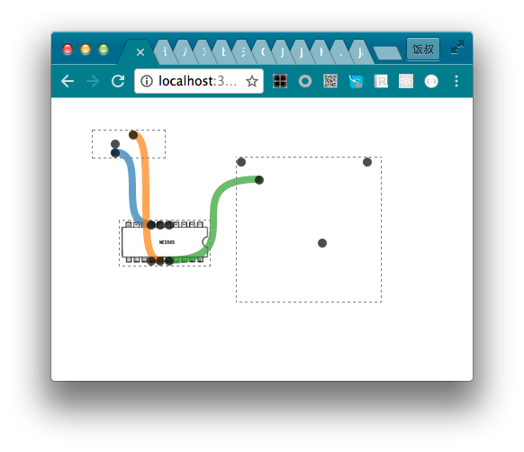

# 电路图原型

### [DEMO](https://fangj.github.io/cir_prototype/demo/index.html)

### 可以拖拽和连接的组件

1格=10px * 10px
组件为宽w格，高h格的网格。
组件内可以有若干个引脚，每个网格内可以有1个,位置用[x,y]表示 
引脚之间可以连线（组件间或组件内） 
拖拽时，组件的位置会自动对齐到最近的网格。

### Board组件

board代表可以放置和拖拽组件的区域
接受一个layout属性表示放置其中的元件和线
例如：

```js
layout={
      comps:{
        a1:{id:"a1",w:10,h:5,x:100,y:200,pins:[[3,0],[4,0],[5,0],[3,4],[4,4],[5,4]],
        background:"img/me5565.jpg"},
        a2:{id:"a2",w:8,h:3,x:300,y:100,pins:[[4,0],[2,1],[2,2]]},
        a3:{id:"a3",w:16,h:16,x:200,y:200,pins:[[0,0],[2,2],[9,9],[14,0]]}
      },
      lines:{
        l1:{id:"l1",from:{comp:"a1",pin:[3,0]},to:{comp:"a2",pin:[2,2]}},
        l2:{id:"l2",from:{comp:"a1",pin:[4,4]},to:{comp:"a2",pin:[4,0]}}
      }
    }
```

comps中是所有组件，lines中是所有线

```js
a1:{id:"a1",w:10,h:5,x:100,y:200,pins:[[3,0],[4,0],[5,0],[3,4],[4,4],[5,4]],
        background:"img/me5565.jpg"}
```

表示有一个id为a1的组件，宽10格，高5格，左上角位置位于相对于父容器left:100像素，top:200像素的位置。  
有6个引脚，分别位于组件内[第3列,第0行],[第4列,第0行]...  
组件有个背景图片为img/me5565.jpg  


```js
 l1:{id:"l1",from:{comp:"a1",pin:[3,0]},to:{comp:"a2",pin:[2,2]}}
```

表示有个id为l1的线，起始点为a1组件的[第3列，第0行]引脚，终点位置为a2组件的[第2列，第2行]引脚。



